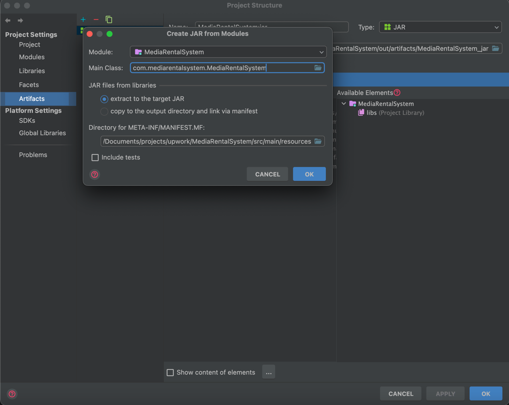

<!-- TOC -->
  * [Application's dependencies](#applications-dependencies)
      * [Required for the Serialization/De-serialization of JSON data](#required-for-the-serializationde-serialization-of-json-data)
      * [Required for some static initialization of certain classes using Reflection](#required-for-some-static-initialization-of-certain-classes-using-reflection)
      * [Required for the Application's logging](#required-for-the-applications-logging)
  * [Running the application](#running-the-application)
  * [How to build the jar file from IntelliJ IDEA?](#how-to-build-the-jar-file-from-intellij-idea)
  * [Application's requirements](#applications-requirements)
  * [Application's Demo/output](#applications-demooutput)
  * [Processing Media files](#processing-media-files)
  * [Command Line Interface (CLI) - Menu Processing](#command-line-interface-cli---menu-processing)
<!-- TOC -->

A well written, menu-based Java command line (CLI) application for the management of media rentals. It can also be
used as a template for any menu-based Java command line (CLI) application. If using it as template, then you'll just 
have to add the relevant classes/extensions and leave the rest on this framework to take care.

## Application's dependencies

Following are the dependencies required for the building and running of the application (categorised by functionality).

#### Required for the Serialization/De-serialization of JSON data

* [jackson-core-xxx.jar][jackson-core-jar-url]
* [jackson-databind-xxx.jar][jackson-databind-jar-url]
* [jackson-annotations-xxx.jar][jackson-annotations-jar-url]

#### Required for some static initialization of certain classes using Reflection

* [javassist-xxx.jar][javassist-jar-url]
* [reflections-xxx.jar][reflections-jar-url]

#### Required for the Application's logging

The reflections dependency added above, also requires the following logging dependencies:

* [slf4j-api-xxx.jar][slf4j-api-jar-url]
* [slf4j-simple-xxx.jar][slf4j-simple-jar-url]

Apart from the above mentioned dependencies, you'll need Java 20 installed on your system.

## Running the application

In order to run the application, either run the [MediaRentalSystem.java][MediaRentalSystem-java] class directly from 
the IDE, or build the jar and then run the jar file as: 

`java -jar out/artifacts/MediaRentalSystem_jar/MediaRentalSystem.jar`.

## How to build the jar file from IntelliJ IDEA?

In order to build the jar file from IntelliJ IDEA:
* Go to the project setting by pressing `command + ;` 
* Then click on the `Artifacts` from the left side menu
* Then click on `+`
* Then click on `Jar` from the opened menu
* Then click on `From the modules with dependencies...`
* And then fill in the opened dialog with required info
* There'll be two option for jar type
  * extract to the target JAR -> It'll create a fat jar which'll include all the required dependencies
  * copy to the output directory and link via manifest -> It'll create a jar without including dependencies.
  It'll rather place the dependencies in the same directory as the jar file and set the path 
  in [MANIFEST.MF][MANIFEST-MF] as:

  `
  Class-Path: javassist-3.29.2-GA.jar slf4j-simple-2.0.7.jar jackson-annotations-2.15.2.jar slf4j-api-2.0.7.jar reflections-0.10.2.jar jackson-databind-2.15.2.jar jackson-core-2.15.2.jar
  `

## Application's requirements

[Click here for the requirements of MediaRentalSystem](readme/MediaRentalSystem-Requirements.md)

## Application's Demo/output

[Click here for the application's demo](readme/Application-Demo.md)

## Processing Media files

[Click here for the processing of the Media files](readme/Media-Files-Processing.md)

## Command Line Interface (CLI) - Menu Processing

[Click here for the processing of the Application Menus](readme/CLI-Menu-Processing.md)

<!-- MARKDOWN LINKS & IMAGES -->
<!-- https://www.markdownguide.org/basic-syntax/#reference-style-links -->
[jackson-core-jar-url]:https://mvnrepository.com/artifact/com.fasterxml.jackson.core/jackson-core
[jackson-databind-jar-url]:https://mvnrepository.com/artifact/com.fasterxml.jackson.core/jackson-databind
[jackson-annotations-jar-url]:https://mvnrepository.com/artifact/com.fasterxml.jackson.core/jackson-annotations
[javassist-jar-url]:https://mvnrepository.com/artifact/org.javassist/javassist
[reflections-jar-url]:https://mvnrepository.com/artifact/org.reflections/reflections
[slf4j-api-jar-url]:https://mvnrepository.com/artifact/org.slf4j/slf4j-api
[slf4j-simple-jar-url]:https://mvnrepository.com/artifact/org.slf4j/slf4j-simple
[MediaRentalSystem-java]:src/main/java/com/mediarentalsystem/MediaRentalSystem.java
[MANIFEST-MF]:src/main/resources/META-INF/MANIFEST.MF